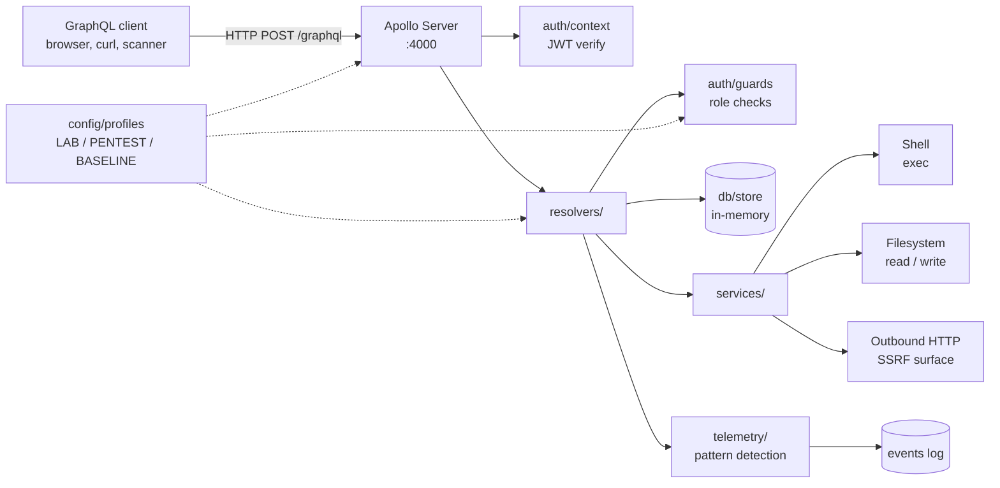

# Vulnerable GraphQL API

[](https://github.com/Cras96/Vulnerable-GraphQL-API/actions/workflows/ci.yml)
[](LICENSE)
[](.nvmrc)

Healthcare management GraphQL API used as a security testbed for a master's thesis on
GraphQL API security at the University of the Aegean.

The server intentionally exposes a range of common GraphQL and web-application
weaknesses (introspection, BOLA/IDOR, mass assignment, command and SQL injection,
SSRF, path traversal, weak JWT, verbose errors, and so on) so that exploits can be
demonstrated and mitigations evaluated against the same baseline.

> The application is **not** intended to be deployed publicly. It runs locally and
> uses an in-memory store with synthetic data only.

## Requirements

- Node.js >= 18
- npm

## Setup

```bash
npm install
cp .env.example .env   # optional, defaults are fine
npm start
```

The server listens on `http://localhost:4000/graphql` by default.

## Running with Docker

A `Dockerfile` and `docker-compose.yml` are provided so the lab can be brought
up without installing Node directly on the host. The compose file binds the
container to **`127.0.0.1` only**, so the API is not reachable from the
network.

Bring it up with the default `LAB_FULLY_VULNERABLE` profile:

```bash
docker compose up --build
```

Pick a different profile through the environment variable:

```bash
TEST_MODE=PENTEST_REALISTIC docker compose up --build
TEST_MODE=BASELINE_HARDENED docker compose up --build
```

Then call the API at `http://localhost:4000/graphql` exactly as in the
non-Docker setup.

Tear the lab down and remove the image:

```bash
docker compose down --rmi local
```

Manual Docker (without compose):

```bash
docker build -t vulnerable-graphql-api .
docker run --rm -p 127.0.0.1:4000:4000 \
  -e TEST_MODE=LAB_FULLY_VULNERABLE \
  vulnerable-graphql-api
```

> Never publish this image to a registry that is reachable from the public
> internet. The container intentionally hosts an exploitable application.

## Security profiles

The behaviour of the server is driven by the `TEST_MODE` environment variable, which
selects one of three profiles defined in [`src/config/profiles.js`](src/config/profiles.js):

| Profile                | Purpose                                                         |
| ---------------------- | --------------------------------------------------------------- |
| `LAB_FULLY_VULNERABLE` | All weaknesses are reachable. Used for guided exploitation labs.|
| `PENTEST_REALISTIC`    | Production-like, with common misconfigurations left in place.   |
| `BASELINE_HARDENED`    | Dangerous features disabled. Used as a comparison baseline.     |

`PENTEST_REALISTIC` is the default. To launch the lab profile:

```bash
npm run lab
```

The active profile and per-feature toggles can be inspected at runtime with the
`securityProfile` query.

## Default credentials

| Username       | Password    | Role    |
| -------------- | ----------- | ------- |
| `admin`        | `admin123`  | ADMIN   |
| `drsmith`      | `doctor123` | DOCTOR  |
| `nurse_jane`   | `nurse123`  | NURSE   |
| `patient_john` | `patient123`| PATIENT |

## Architecture



## Project layout

```
src/
├── server.js           Apollo Server bootstrap
├── config/             Security profiles and hard-coded secrets
├── db/                 In-memory store and seed data
├── schema/             GraphQL type definitions
├── resolvers/          Query, Mutation and relation resolvers
├── auth/               JWT signing, request context, role guards
├── services/           Search, filesystem, shell and HTTP helpers
├── telemetry/          Assessment event recording and pattern detection
└── utils/              Sanitisation and rate limiting
tests/                  Smoke tests (node --test)
```

## Assessment helpers

When the server detects a recognisable attack pattern (SQLi heuristics, command
injection, path traversal, SSRF to private hosts, stored XSS payloads, privilege
escalation, etc.) it records an entry in an in-memory event log. Admins can read
this back through:

```graphql
query {
  assessmentSummary { totalEvents criticalEvents highEvents mediumEvents lowEvents }
  assessmentEvents(limit: 25) { timestamp category vector severity payload actor }
}
```

To wipe the log and reset the in-memory data set:

```graphql
mutation {
  resetTestData(confirmPhrase: "reset-test-data-confirmed")
}
```

## Documentation

- [`VULNERABILITIES.md`](VULNERABILITIES.md) - inventory of intentional weaknesses, grouped by category.
- [`MITIGATIONS.md`](MITIGATIONS.md) - production-grade fix per weakness, with the matching profile knob.
- [`PAYLOADS.graphql`](PAYLOADS.graphql) - example queries and mutations that exercise each weakness.
- [`docs/WALKTHROUGH.md`](docs/WALKTHROUGH.md) - step-by-step lab tour comparing the LAB and BASELINE profiles.
- [`CHANGELOG.md`](CHANGELOG.md) - release notes.

## Codespaces / Dev Containers

The repository ships a `.devcontainer/` config. Opening the repo in GitHub
Codespaces or in VS Code's Dev Containers extension gives a ready-to-run
Node 20 environment with ESLint, REST Client and GraphQL extensions
pre-installed and the lab profile pre-selected.

## Disclaimer and safe-use boundaries

This repository exists exclusively for academic research and security education.
It is an intentionally vulnerable GraphQL API and must be executed only on
`localhost`, `127.0.0.1`, or an isolated private lab environment controlled by
the user.

Do not deploy this application as a public internet-facing service. Do not run
the included payloads, queries, mutations, or testing procedures against any
third-party system unless you have explicit written authorization from the
system owner.

All data included in the testbed is synthetic. Do not add real personal data,
medical data, production secrets, API keys, credentials, or tokens to this
repository.

This project is not an exploit framework and is not intended to support
unauthorized access, scanning, denial-of-service activity, data exfiltration, or
any other harmful activity. By using it, you are responsible for keeping the
execution environment isolated and for complying with applicable laws,
institutional rules, and authorization requirements.

See also [`DISCLAIMER.md`](DISCLAIMER.md) and [`SECURITY.md`](SECURITY.md).
